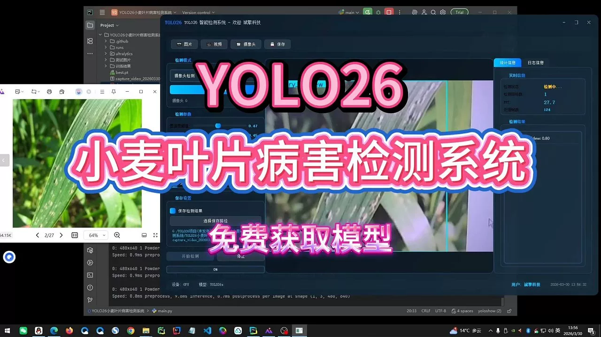
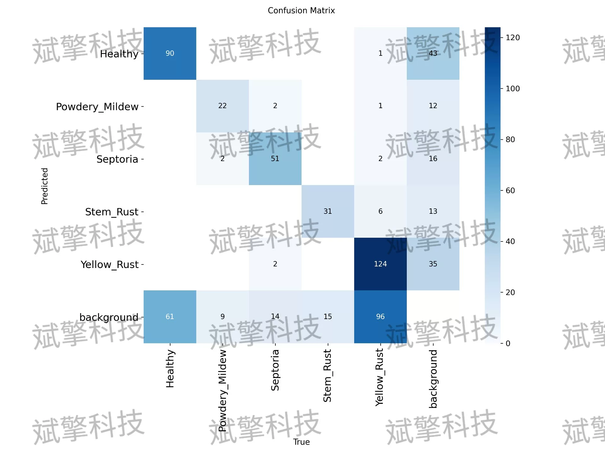
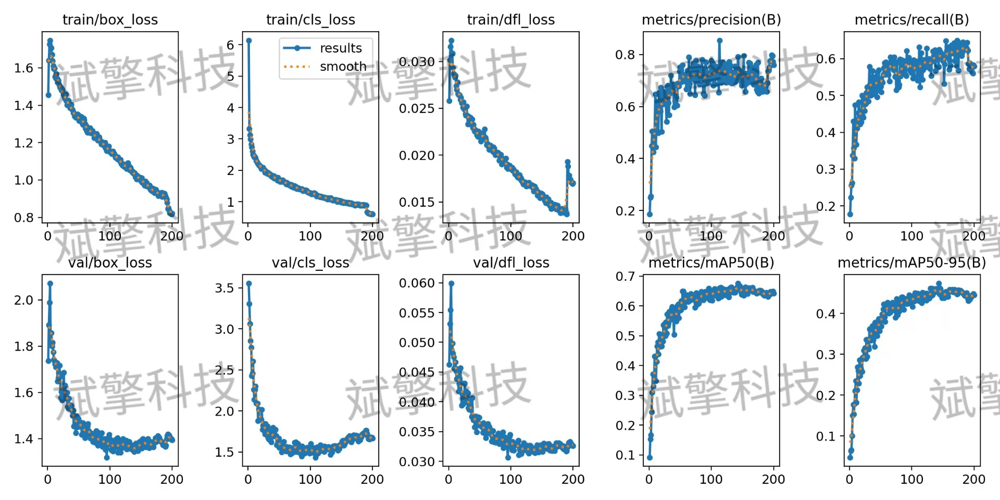
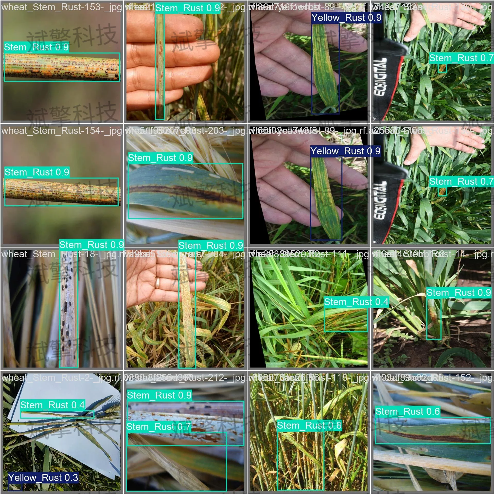
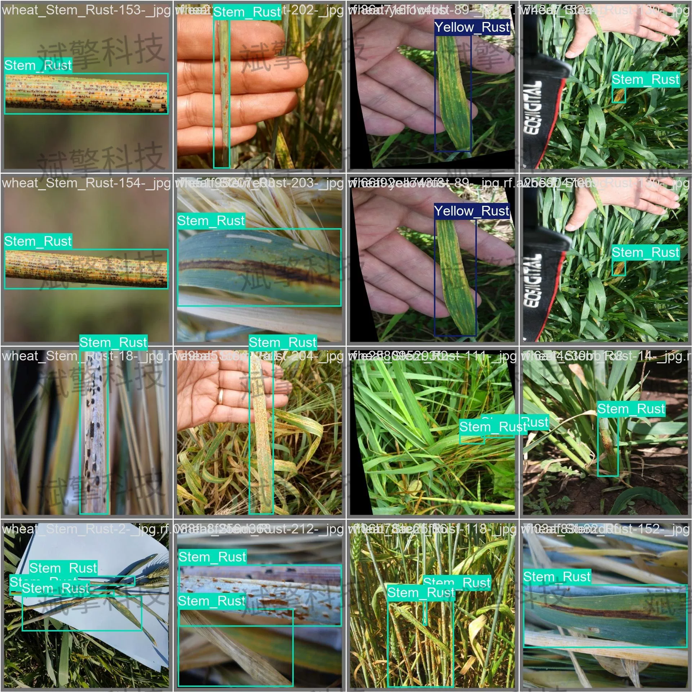
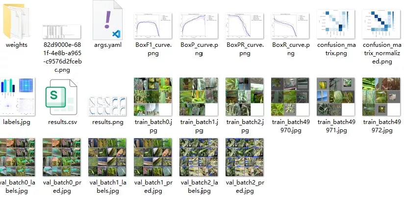
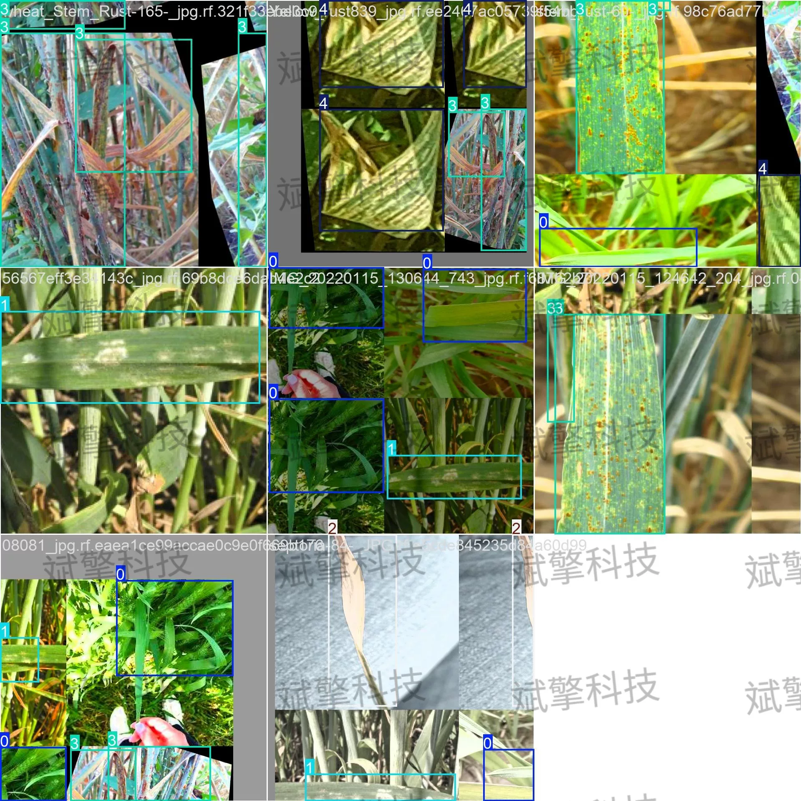
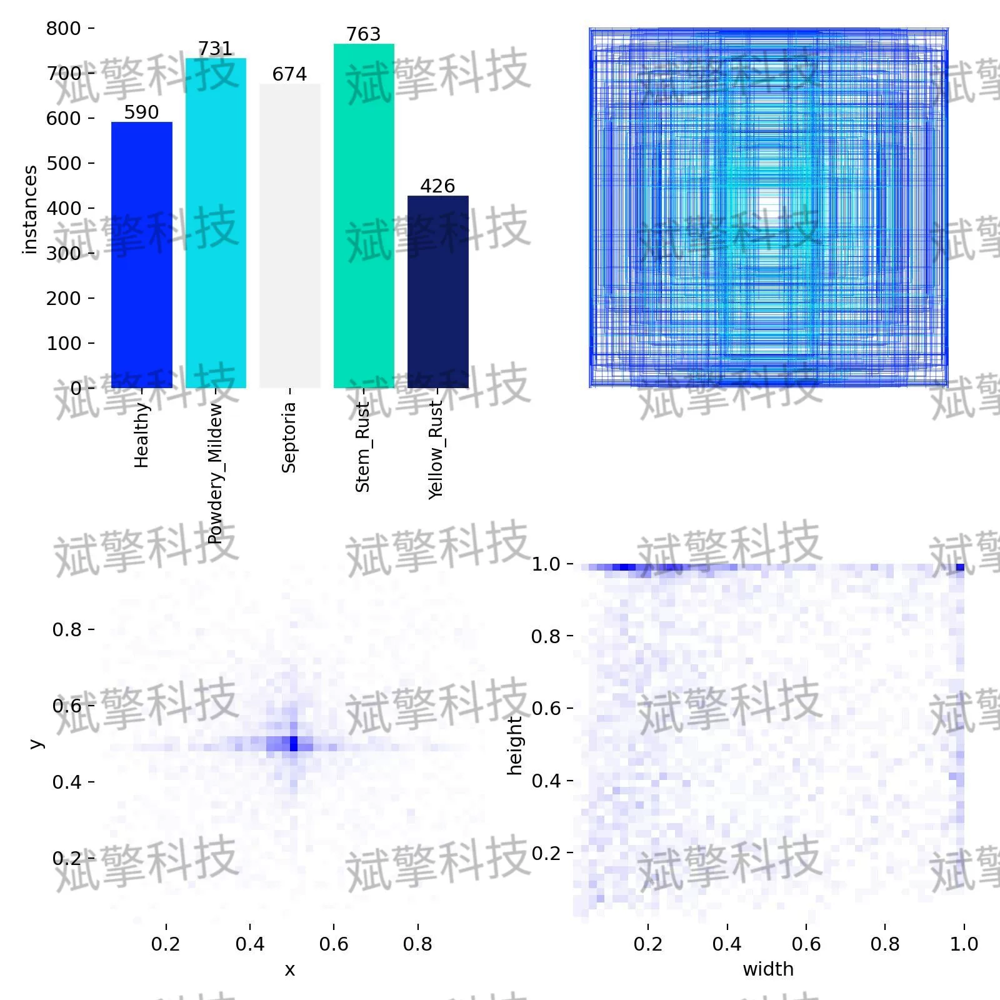

# YOLO26 Wheat Leaf Disease Detection System | Source Code

## Body

YOLO26 Wheat Leaf Disease Detection System | Source Code Based on YOLO26 Deep Learning for Wheat Leaf Disease Detection System (Project Source Code + Dataset + Model Weights + UI Interface + Python + Deep Learning + Remote Environment Deployment)

This study proposes a lightweight wheat leaf disease detection system based on YOLO26, aiming to achieve real-time and precise recognition of five categories of wheat leaf states: "healthy", "powdery mildew", "leaf blight", "stem rust", and "stripe rust". The system uses the YOLO26 model and trains 200 rounds in an NVIDIA RTX 4090 D environment, with training set (2100 images), validation set (366 images), and test set (138 images).

The wheat leaf disease dataset constructed in this study includes five labels: Healthy (healthy), Powdery Mildew (powdery mildew), Sepedora (leaf blight), Stem Rust (stem rust), Yellow Rust (stripe rust).

Free appointment for remote installation. Unsuccessful installation will result in a full refund.
Purchase comes with the following resources (auto-unlocked in Baidu Pan):
   - Complete source code for YOLO identification detection project
   - YOLO format dataset
   - Training code + UI interface code
   - Trained model + results image
   - Software installation package
   - Add WeChat to make an appointment for remote installation (automatically displayed WeChat ID after purchase) - Unsuccessful, full refund

⚙️ Core Function Modules
Detection Capabilities
    Image Detection: Upon upload, returns detection boxes + category information
    Video Detection: Supports video files, analyzes frames accurately
    Camera Real-Time Detection: Integrates USB camera, realizes dynamic monitoring
Interaction and Control
    Target Selection: Choose one or more categories for detection
    Parameter Real-Time Adjustment: Adjustable confidence threshold & IoU threshold, flexible control accuracy
    Result Save: One-click save of images/videos/camera detection results
System and Data
    User Login and Registration: Supports password strength check + encryption storage
    Log Recording: Auto records operation and error information (timestamped)

## Images

## Payment

Here is a pay link on Stripe ( https://buy.stripe.com/3cs8yP7sY87d0vu9AB ). Please contact me lonlonago@foxmail.com after funding $89, and I will send you a complete data files , thank you!

